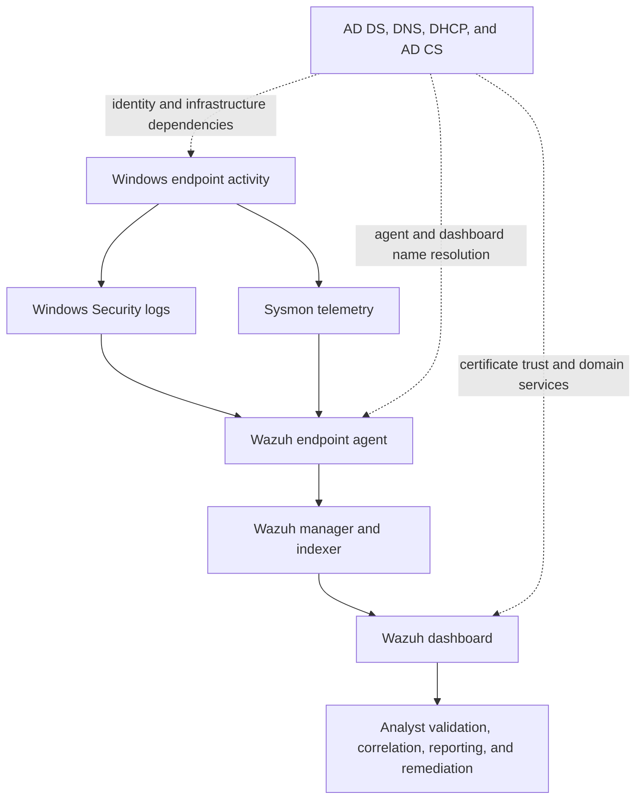

# Historical architecture

This diagram shows the components I connected in the completed independent lab and their historical data flow.

## Components and responsibilities

| Component | Role in the historical lab |
| --- | --- |
| AD DS | Domain identity and authentication |
| DNS and DHCP | Name resolution, addressing, and connectivity dependencies |
| AD CS | Certificate services used for trusted HTTPS access |
| Windows endpoints | Sources of Security log and Sysmon telemetry |
| Wazuh agent | Endpoint collection and forwarding |
| Wazuh manager/indexer/dashboard | Central monitoring, search, and analyst review |
| Sysmon | Additional process, network, file, registry, and DNS context |

The original VMs, dashboard state, screenshots, and event exports are no longer retained due to needing storage space for future labs.
